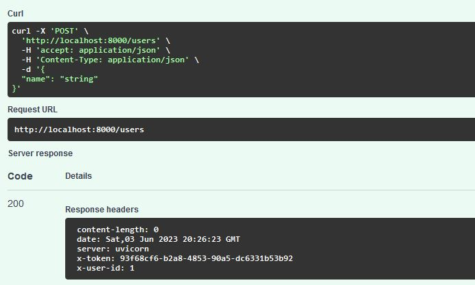
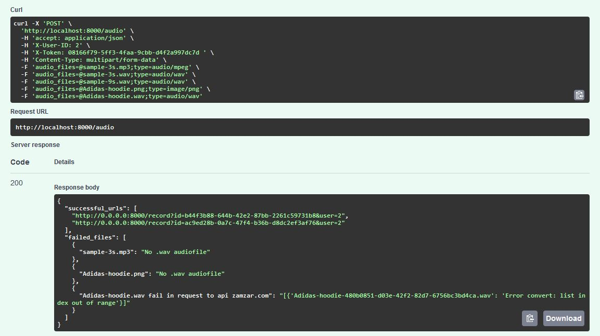
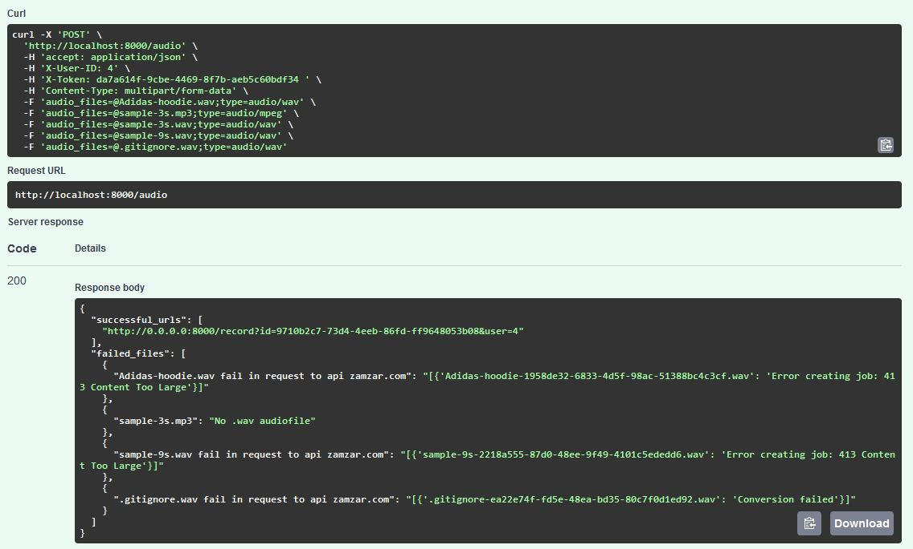
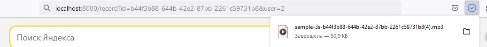

# Audio repository

Веб-сервис, выполняет следующие функции:
1. Создание пользователя;
2. Для каждого пользователя:
	- сохранение аудиозаписи в формате wav
	- преобразование её в формат mp3
	- запись в базу данных
	- предоставление ссылки для скачивания аудиозаписи

Приложение реализует преобразование как самостоятельно, так и при помощи стороннего сервиса. По-умолчанию настроено самостоятельное преобразование.

### Необязательно! Работает без этого, сделано для примера!

Для работы со стронним сервисом нужно зарегистрироваться на https://developers.zamzar.com/ и получить API ключ.

## Установка
### Клонируем репозиторий

    mkdir app

    cd cat app

    git clone https://github.com/se-andrey/audio_repository.git

### Создаем .env 

    nano .env

1) Если нужна самостоятельная конвертация файлов:

		FFMPEG=yes
2) Для конвертации внешим api:

        API_KEY= 
        FFMPEG=no

### Запуск

Если на сервере нет docker/docker-compose, то установите его - инструкция https://docs.docker.com/
    
	docker-compose up --build 

docker-compose работает на host 0.0.0.0 и порт 8000, можете изменить в файле docker-compose.yml

### Пример использования

Эндпоинты

Создаем пользователя

Результаты обработки файлов:
1) Самостоятельная обработка
   
Отправляем 5 файлов: 2 .wav + 2 другого формата + 1 .jpg, переименнованный в .wav  

2) Обработка сторонним API
Отправляем 5 файлов: 1 .wav + 1 другого формата + 4 файла, переименнованных в .wav  

Скачиваем файл по полученной ссылке

