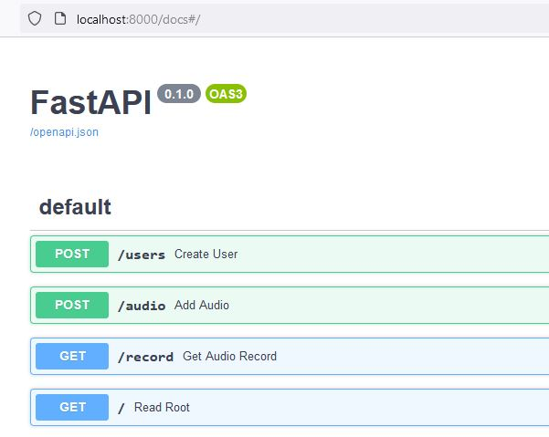
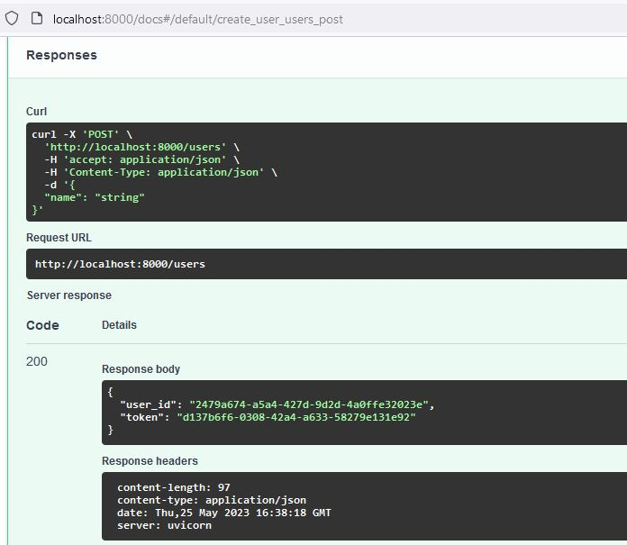
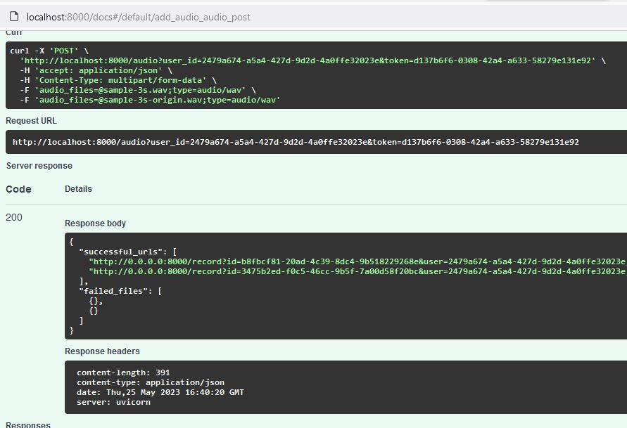
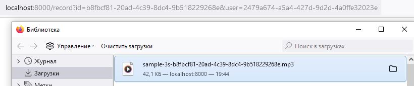

# Audio repository

Веб-сервис, выполняет следующие функции:
1. Создание пользователя;
2. Для каждого пользователя:
	- сохранение аудиозаписи в формате wav
	- преобразование её в формат mp3
	- запись в базу данных
	- предоставление ссылки для скачивания аудиозаписи

Для работы нужно зарегистрироваться на https://developers.zamzar.com/ и получить API ключ.
## Установка
### Клонируем репозиторий

    mkdir app

    cd cat app

    git clone https://github.com/se-andrey/audio_repository.git

### Создаем .env

    nano .env

API_KEY=

### Запуск

Если на сервере нет docker/docker-compose, то установите его - инстукция https://docs.docker.com/
    
	docker-compose up --build 

docker-compose работает на host 0.0.0.0 и порт 8000, можете изменить в файле docker-compose.yml

### Пример использования

Эндпоинты

Создаем пользователя

Отправляем 2 файла .wav 

Скачиваем файл по полученной ссылке

